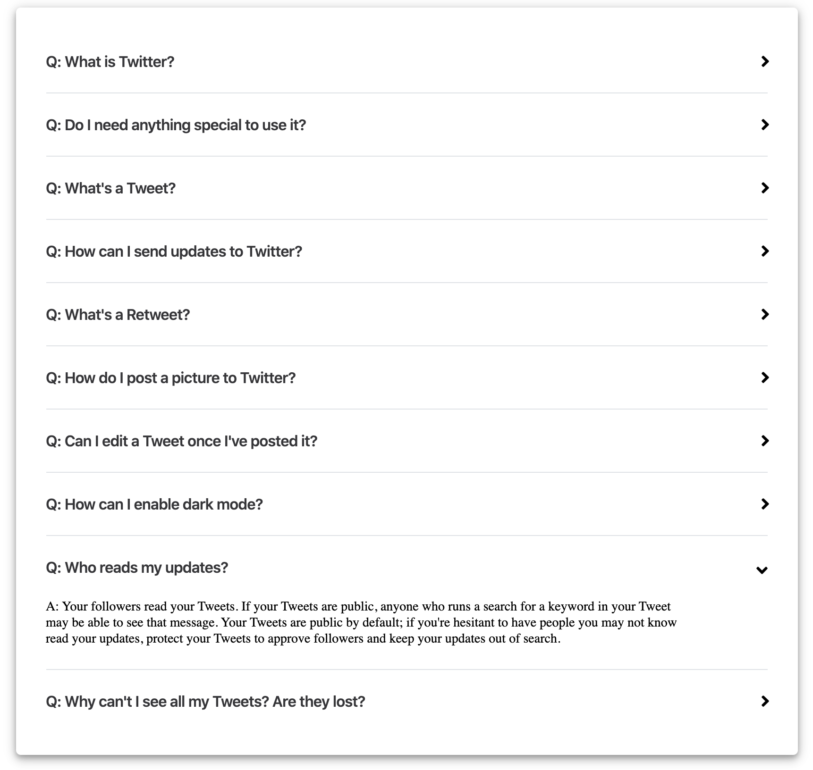
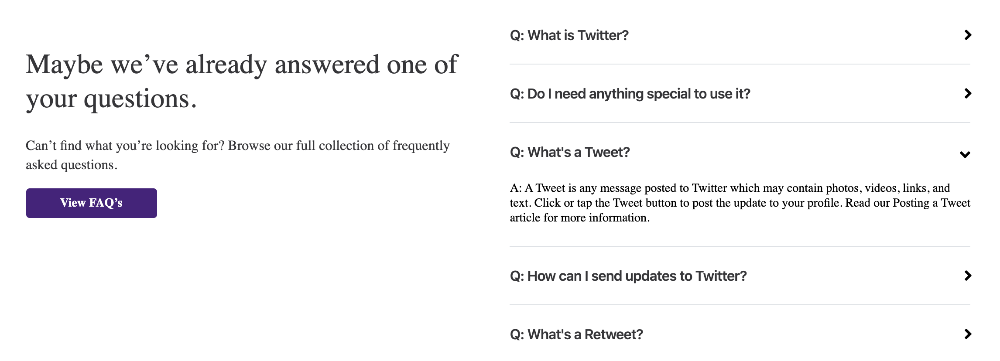

# FAQ Multi-use Accordion

Multi-use Accordion uses [react-light-accordion](https://www.npmjs.com/package/react-light-accordion) to create a reusable FAQ component with two built in use cases: Full FAQ Page View and a FAQ Splash View for use on other pages. 






## Installation

FAQ Multi-use Accordion is a React component requiring 
* Three React files: The full page view, the splash view, and the accordion
* Font Awesome "Angle-Down-Solid" icon. (In this case, it is installed as a .svg in the src folder.)
* An array of objects with key value pairs: "question" and "answer."

## Usage

FAQ Multi-use Accordion works with an array of objects using the key value pairs: "question" and "answer."
```json
[
    {
        "question": "Q: What is Twitter?",
        "answer": "A: Twitter is a service for friends, family, and coworkers..."
    },
    {
        "question": "Q: Do I need anything special to use it?",
        "answer": "A: All you need to use Twitter is an internet connection or a mobile phone."
    }
]
```

For full page view:

**_important_: if you want to view the full return of your FAQ content, the count must be set to 0.
```react
import React from "react";
import FAQAccordion from "./faqAccordion";

const Faq = () => {
  return (
    <div className="contentPage">
        <FAQAccordion count={0} />
    </div>
  );
};

export default Faq;
```

For splash view:

In splash view, set a count for how many FAQs you'd like to pop up in the splash. 
```react
import React from "react";
import FAQAccordion from "./faqAccordion";

const FaqSplash = () => {
  return (
    <div className="faqSplashHolder">
      <div className="faqSplash">
        <div>
          <h2>Maybe we’ve already answered one of your questions.</h2>
          <p>
            Can’t find what you’re looking for? Browse our full collection of
            frequently asked questions.
          </p>
          <div>
            <a href="/faq">View FAQ’s</a>
          </div>
        </div>
        <FAQAccordion count={5} />
      </div>
    </div>
  );
};

export default FaqSplash;

```

## API Connection
Connecting to API return for FAQ content should happen in the useEffect statement in faqAccordion.jsx 